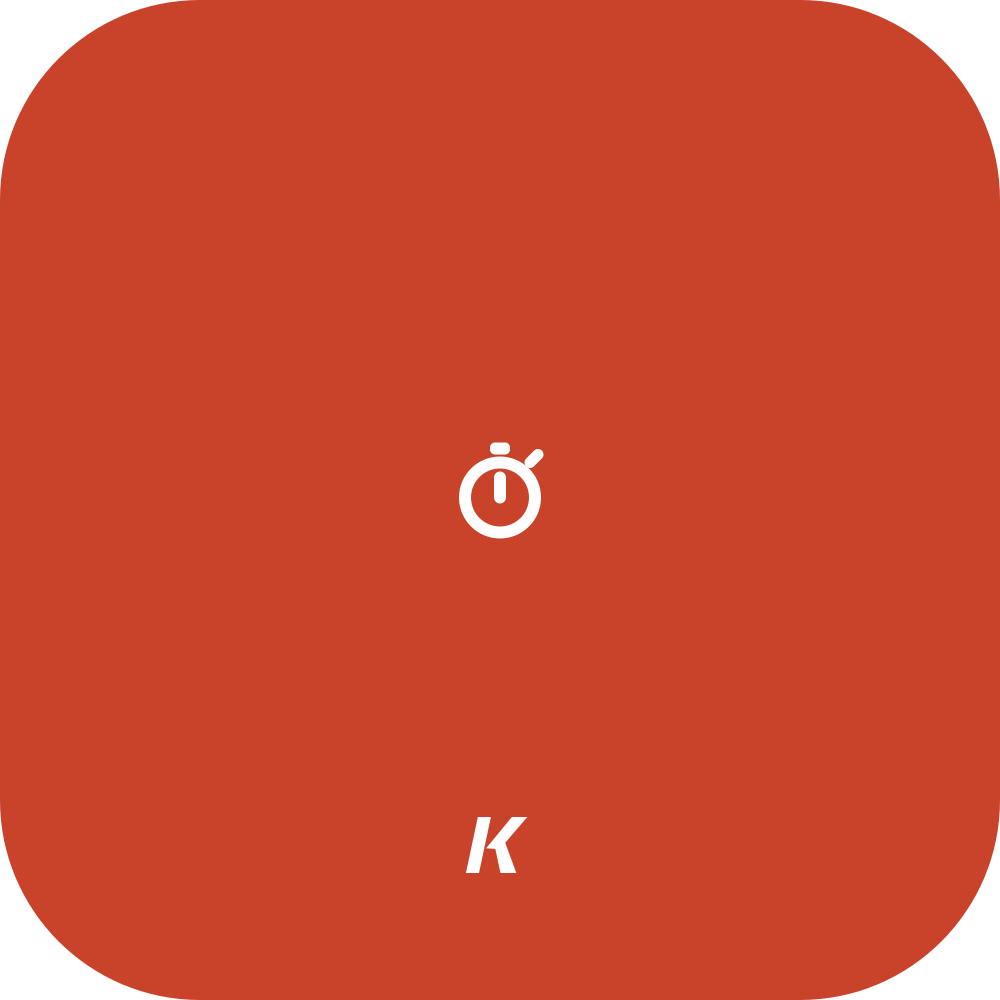
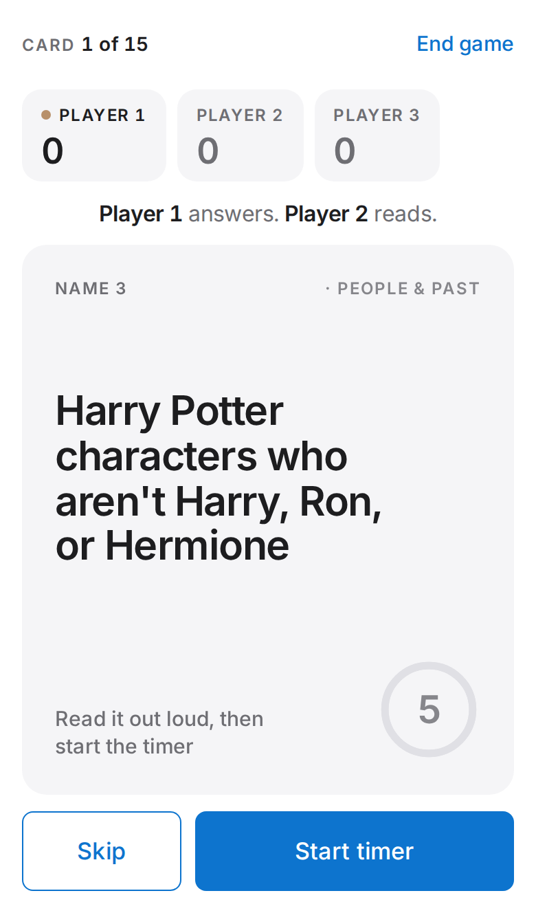

<p align="center"></p>

# Name 3 in 5

**Flip a card. Name three things. You've got five seconds. Go.**

### ▶ [Play it now](https://datakyle.github.io/5-in-3/)

One phone, passed around the room. No app, no accounts, no setup longer than it takes to type everyone's name.



## Why this exists

I wanted a game I could pull up on a random weeknight with zero prep. No box to find, no rules to explain, no one sitting out.

Turns out five seconds is the perfect amount of time. It's long enough that you *should* get it and short enough that your brain completely leaves your body. You will forget every animal that exists. Everyone watching will know three immediately and they will let you hear about it.

## How to play

1. Add 2 to 12 players and pick your categories.
2. Tap **Reveal card**. The next person reads it out loud.
3. Tap **Start timer**. The player on the spot names three before the buzzer.
4. The reader is the judge. **Got all 3** is a point. Pass the phone.

Most points when the cards run out (or when someone yells "last round") wins.

## Why you'll play it again

- **640 original prompts** across 9 categories, from *animals that start with Q* to *things you'd yell at a referee*.
- **It remembers what you've seen.** New cards always come first, so game night #12 still feels fresh.
- **No repeats in a game, no streaks of the same category.** Three food cards in a row is nobody's idea of fun.
- **After Dark mode (18+).** 86 cards about drinking, dating, and bad decisions. Off by default, because this gets played with families too.
- Countdown ring, beeps, buzzer, and a little buzz on phones that support it.

## Write a card

The best way to help: add a prompt that made your table argue.

All the cards live in [`questions.js`](questions.js). Each one is read as "Name 3 …", so write only the part after that:

```js
"countries in South America that <em>aren't</em> Brazil",
```

Then run the checker so you don't add a duplicate:

```sh
node scripts/check-questions.mjs
```

What makes a great card is in [CONTRIBUTING.md](CONTRIBUTING.md). Short version: answerable in five seconds, at least ten possible answers, a twist if you can find one.

<details>
<summary><b>Under the hood</b></summary>

### How cards avoid repeating

- Every prompt gets a stable ID from its text, so adding new prompts never resets anyone's history.
- A card counts as seen once it's revealed. Seen cards are saved on your device.
- New cards always come first. Once you've seen everything in your chosen categories, the game deals the ones you saw longest ago.
- A card never comes up twice in one game, and categories take turns.
- The setup screen shows how many cards are still new, with a reset button.

The logic lives in [`deck.js`](deck.js).

### Run it locally

Open `index.html` in a browser. That's it.

### Host your own copy

Fork this repo, then go to **Settings → Pages → Source: GitHub Actions**. The included workflow publishes the game on every push to `main`.

</details>

---

Built by [Kyle](https://github.com/datakyle). I make small things that get people off their phones by, ironically, passing one around.

Also made: [Life in Weeks](https://github.com/datakyle/life-cal), your whole life on one screen, one square per week.

[MIT](LICENSE). The prompts are original to this project and covered by the same license. Not affiliated with any commercial "5 second" card game.
